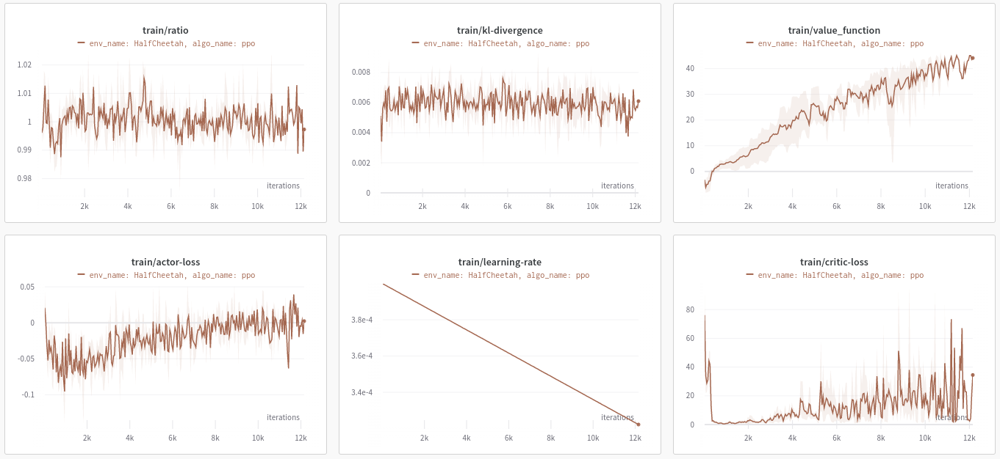
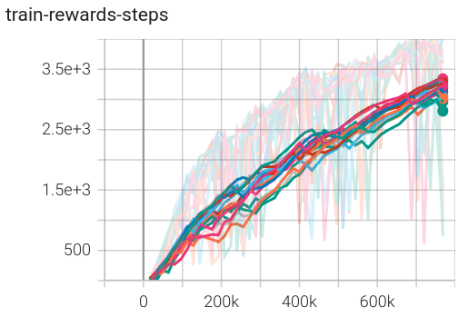
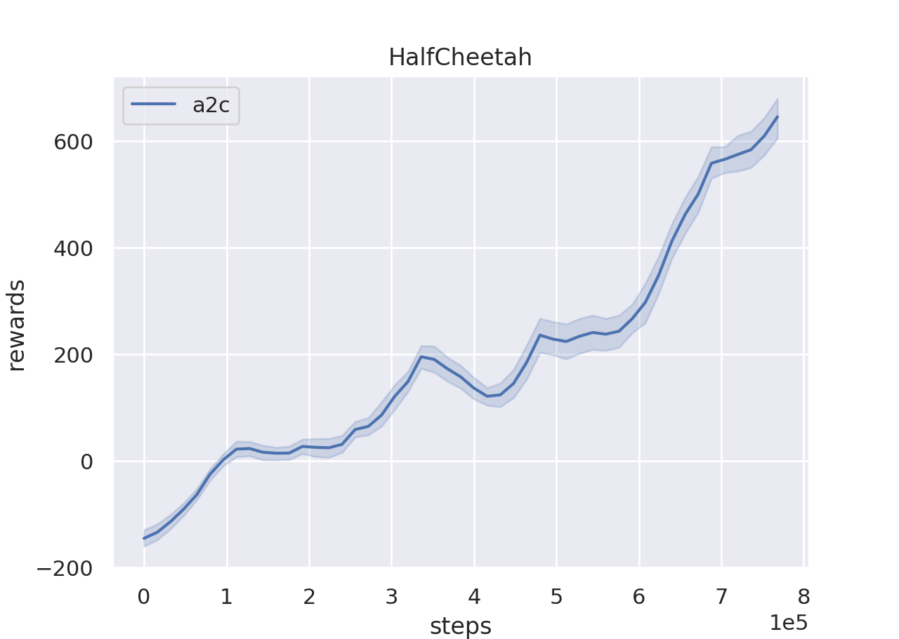
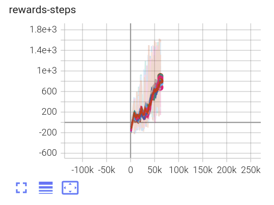
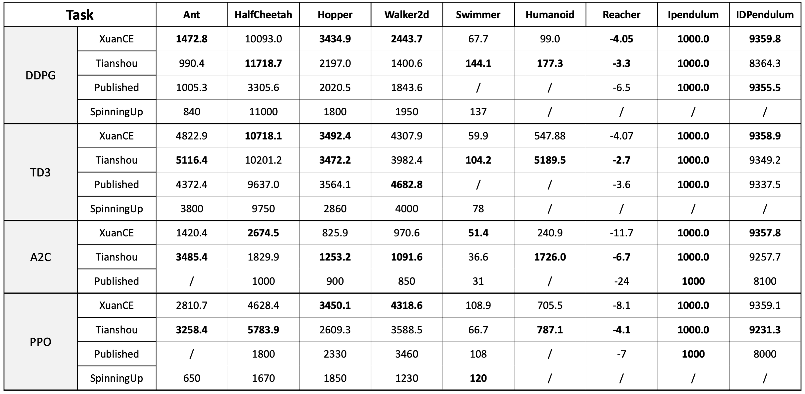
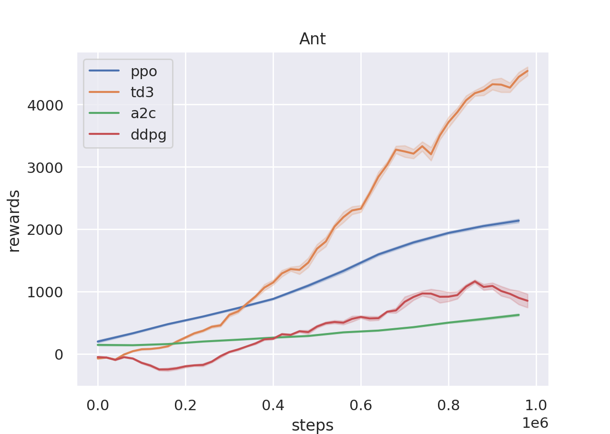
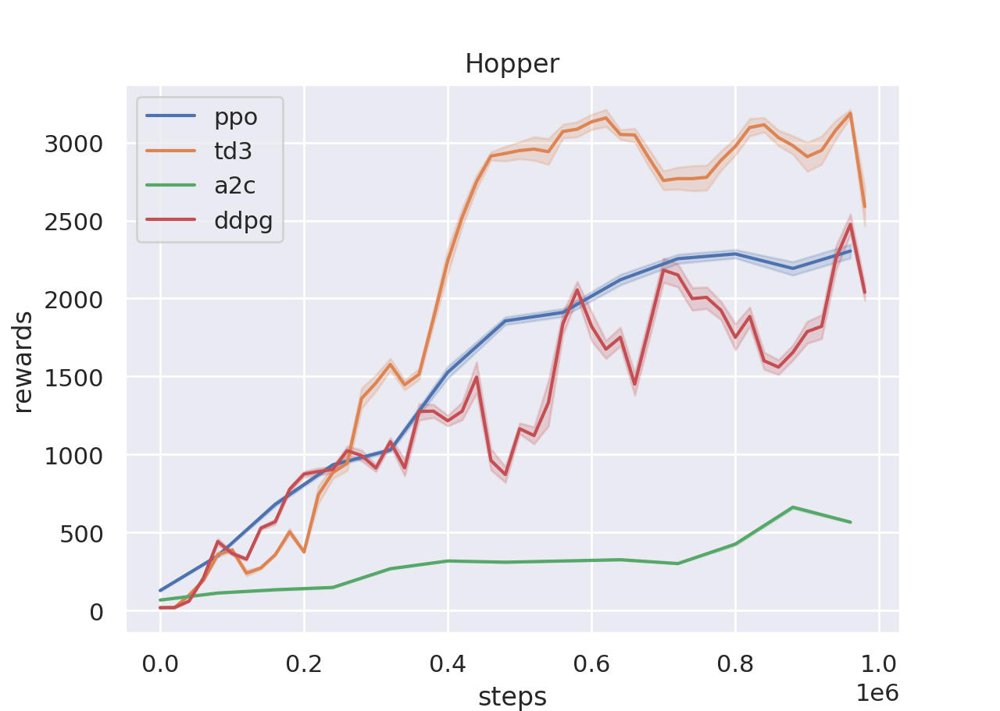
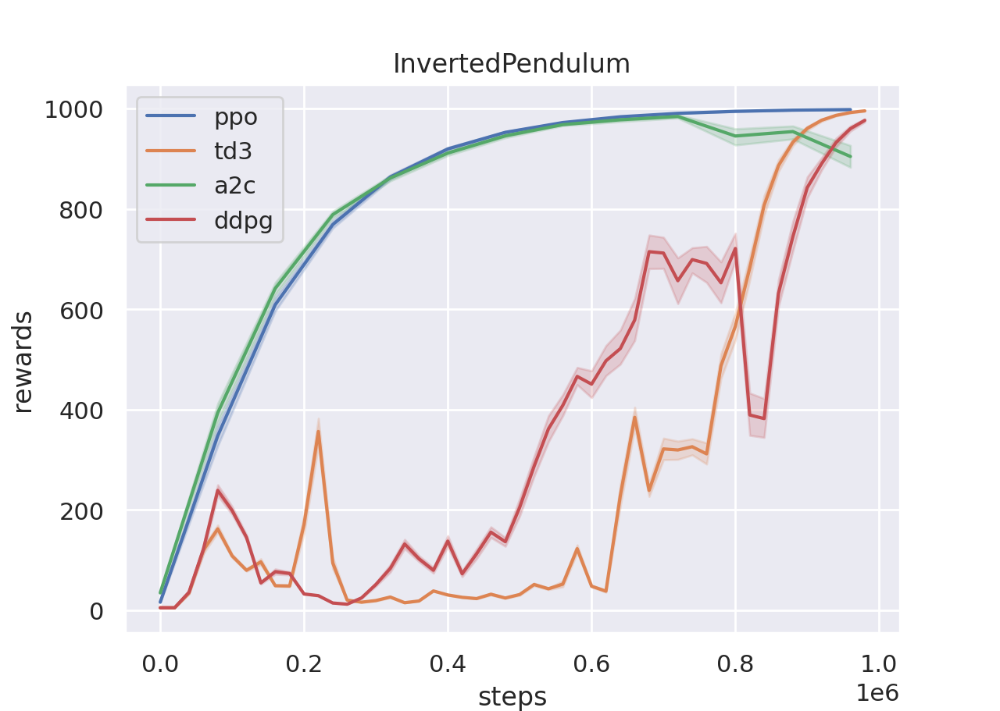

## XuanCE: A simple framework and implementations of reinforcement learning algorithms ##


XuanCE is a reinforcement learning algorithm platform which supports multiple deep learning frameworks (Pytorch, TensorFlow, Mindspore) and both multi-agent RL and single-agent RL methods. This repository is a pruned version of the original project [XuanPolicy](https://github.com/agi-brain/xuanpolicy) with only Pytorch-based implementations and single-agent RL algorithms. 
We make this repo as much as highly-modularized and clean to be friendly for the RL starters.
This framework is also compatiable and easy-to-use for researchers to implement their own ideas.

- For example, if you want to benchmark the RL algorithms on some novel problems, just following the example provided in <strong><em> xuance/environment/custom_envs/*.py </em></strong> to formalize a novel problem into Markov Decision Process (MDP) as a gym-based wrapper. A tutorial is provided [here](https://xuance.readthedocs.io/en/latest/).
- If you want to try some advanced representation network as state encoding, just following the example provided in <strong><em> xuance/representation/network.py </em></strong> to define a new class based on <strong><em> torch.nn.Module</em></strong>. A tutorial is provided [here](https://xuance.readthedocs.io/en/latest/).
- If you figure out a better way for RL optimization process, just add a learner similar to the <strong><em> xuance/learner/*.py </em></strong> and define your own loss function. You can compare difference in <strong><em> xuance/learner/a2c.py </em></strong> and <strong><em> xuance/learner/ppo.py </em></strong> for your own implementation. 
- If you propose a more efficient memory buffer and experience replay scheme, just add your own memory buffer class in <strong><em> xuance/utils/memory.py </em></strong> and replace the memory used in the <strong><em> xuance/agents/*.py </em></strong>
- ...
- More details of the usage can be found in the [documentions](https://xuance.readthedocs.io/en/latest/).

In summary, our high-modularized design allows to focus on unit design and improvements with other parts untouched. 
The highlighs of our project are listed below:
- Support custom environment, policy network, and optimization process
- Support custom policy evaluation with a different environment from the training
- Support dictionary observation inputs
- Support dictionary network outputs
- Support efficient environments parallization ([EnvPool](https://github.com/sail-sg/envpool))
- Support Weights & Bias Logger and Tensorboard Logger ([WandB](https://wandb.ai/))
- Support Video Capturing
- Benchmarking Experiments

Currently, this repo supports the following RL algorithms which are:
- Advantage Actor-Critic(A2C) [[paper](https://arxiv.org/pdf/1602.01783v2.pdf)]
- Proximal Policy Optimization(PPO) [[paper](https://arxiv.org/pdf/1707.06347.pdf)]
- Deep Deterministic Policy Gradient(DDPG) [[paper](https://arxiv.org/pdf/1509.02971.pdf)]
- Twin Delayed DDPG(TD3) [[paper](https://arxiv.org/pdf/1802.09477.pdf)]
- Deep-Q Network(DQN) [[paper](https://arxiv.org/pdf/1312.5602.pdf)]
- Dueling-Q Network(Dueling-DQN) [[paper](https://arxiv.org/pdf/1511.06581.pdf)]
- Double-Q Network(DDQN) [[paper](https://arxiv.org/pdf/1509.06461.pdf)]
- Generalizaed Advantage Estimation(GAE) [[paper](https://arxiv.org/pdf/1506.02438.pdf)]
## Installation ##
You can clone this repository and install an editable version locally:
```
$ conda create -n xuance python=3.8
$ conda activate xuance
$ git clone https://github.com/wzcai99/xuance.git
$ cd xuance
$ pip install -e .
```

## Quick Start ## 
You can run the RL algorithms with the provided examples, 
```
$ python -m example.run_ppo
```
or follow the belowing step-by-step instructions.

**Step 1: Define all the hyper-parameters in PyYAML format.**

Here is an example of configuration file of PPO.

```
algo_name: ppo  # The name of the algorithm, used for logger
env_name: InvertedDoublePendulum  # The env_id of the algorithm, used for logger
seed: 7891 # random seed

nenvs: 16      # environments runs in parallel
nsize: 256     # how many steps per environment to collect for policy iteration
nminibatch: 8  # batchsize = nenvs * nsize / nminibatch 
nepoch: 16     # iteration times = nepoch * nminibatch

vf_coef: 0.25      # value function loss weight
ent_coef: 0.00     # policy entropy regularization weight
clipgrad_norm: 0.5 # gradient clipping norm
clip_range: 0.20   # ppo surrogate clip ratio
target_kl: 0.01    # restriction of the kl-divergence with the old policy
lr_rate: 0.0004    # learning rate

save_model_frequency: 1000 # policy model save frequency per iterations
train_steps: 62500         # training steps = train_steps * nenvs
evaluate_steps: 10000      # evaluate frequency per steps

gamma: 0.99  # discount-factor
tdlam: 0.95  # td-lambda in GAE

logger: wandb # logger, you can choose wandb or tensorboard
logdir: "./logs/" # logging directory
modeldir: "./models/" # model save directory
```
**Step 2: Import some relavant packages:**
```
import torch
import torch.nn as nn
import torch.nn.functional as F
import argparse
import gym
from xuance.utils.common import space2shape,get_config
```
**Step 3: Parse some relavant arguments:**
```
def get_args():
    parser = argparse.ArgumentParser()
    parser.add_argument("--device",type=str,default="cuda:0")
    parser.add_argument("--config",type=str,default="./config/a2c/")
    parser.add_argument("--domain",type=str,default="mujoco")
    parser.add_argument("--env_id",type=str,default="HalfCheetah-v4")
    parser.add_argument("--pretrain_weight",type=str,default=None)
    parser.add_argument("--render",type=bool,default=False)
    args = parser.parse_known_args()[0]
    return args
args = get_args()
device = args.device
config = get_config(args.config,args.domain)
```
Note that the argument **config** is the directory saving the PyYAML file and the argument **domain** is the filename of the PyYAML file.

**Step 4: Define a training environments (Vector)**
```
from xuance.environment import BasicWrapper,DummyVecEnv,RewardNorm,ObservationNorm,ActionNorm
train_envs = [BasicWrapper(gym.make(args.env_id,render_mode='rgb_array')) for i in range(config.nenvs)]
train_envs = DummyVecEnv(envs)
train_envs = ActionNorm(envs)
train_envs = ObservationNorm(config,envs,train=(args.pretrain_weight is None))
train_envs = RewardNorm(config,envs,train=(args.pretrain_weight is None))
```
Note that in some RL algorithms (e.g. A2C, PPO), normalizing the observation data and scaling the reward value is essential for data efficiency, therefore, we introduce the ActionNorm, ObservationNorm, and RewardNorm. But you can make adjustments according to your needs.

**Similarly, EnvPool-based vector environments are also supported.**
```
from xuance.environment import EnvPool_Wrapper,EnvPool_ActionNorm,EnvPool_RewardNorm,EnvPool_ObservationNorm
train_envs = envpool.make(args.env_id,"gym",num_envs=config.nenvs)
train_envs = EnvPool_Wrapper(train_envs)
train_envs = EnvPool_ActionNorm(train_envs)
train_envs = EnvPool_RewardNorm(config,train_envs,train=(args.pretrain_weight is None))
train_envs = EnvPool_ObservationNorm(config,train_envs,train=(args.pretrain_weight is None))
```

**Step 5: Define a representation network for state encoding.**
```
from xuance.representation import MLP
representation = MLP(space2shape(envs.observation_space),(128,128),nn.LeakyReLU,nn.init.orthogonal_,device)
```
**Step 6: Define the policy head on the top of the representation network.**

For the discrete action space:
```
from xuance.policy import Categorical_ActorCritic
policy = Categorical_ActorCritic(envs.action_space,representation,nn.init.orthogonal_,device)
```
For the continuous action space:
```
from xuance.policy import Gaussian_ActorCritic 
policy = Gaussian_ActorCritic(envs.action_space,representation,nn.init.orthogonal_,device)
```
If you want to load a pre-trained policy weight:
```
if args.pretrain_weight:
    policy.load_state_dict(torch.load(args.pretrain_weight,map_location=device))
```

**Step 7: Define an optimizer and a learning rate scheduler:**
```
optimizer = torch.optim.Adam(policy.parameters(),config.lr_rate)
scheduler = torch.optim.lr_scheduler.LinearLR(optimizer, start_factor=1.0, end_factor=0.1,total_iters=config.train_steps/config.nsize * config.nepoch * config.nminibatch)
```

**Step 8: Define the RL learner and agent.**
```
from xuance.learner import PPO_Learner
from xuance.agent import PPO_Agent
learner = PPO_Learner(config,policy,optimizer,scheduler,device)
agent = PPO_Agent(config,envs,policy,learner)
```

**Step 9: Train and evaluate the RL agent.**

Train the RL agent:
```
agent.train(config.train_steps)
```

In many cases, the RL algorithm will be evaluated on a different environment to test the generalization ability, Therefore, in our framework, before evaluating the policy, it is necessary to define a function to build the test environment. Here is an example:
```
def build_test_env():
    test_envs = [BasicWrapper(gym.make(args.env_id,render_mode="rgb_array")) for _ in range(1)]
    test_envs = DummyVecEnv(test_envs)
    test_envs = ActionNorm(test_envs)
    test_envs = RewardNorm(config,test_envs,train=False)
    test_envs = ObservationNorm(config,test_envs,train=False)
    return test_envs
```
Then, you can test your RL agent by parsing the function
```
test_env = build_test_env()
agent.test(test_env,10,args.render) # test for 10 episodes
```
You can also run a benchmark experiment as follows:
```
agent.benchmark(build_test_env,config.train_steps,config.evaluate_steps,render=args.render)
```
The benchmark function will automatically switch between training and evaluation.

**Step 10: Use the tensorboard of the wandb to visualize the training process.**
For the usage of the wandb, we recommand to run a wandb server locally to avoid the network error, to install and run the wandb locally, follow the tutorial [here](https://github.com/wandb/server). If everything goes well, the wandb logging and the tensorboard logging will show as follows:
<div align=center>
<figure>


</figure>
</div>


<!-- After that, you can use tensorboard or the plotter to see the training curve.
```
$ tensorboard --logdir=./logs/ --port=6007
```
```
$ python -m xuance.utils.tensorboard_plotter --env_name=HalfCheetah --log_dir=./logs/ --y_smooth=0.9 --x_smooth=1000
```
<div align=center>
<figure>


</figure>
</div> -->

<!-- 
 -->

## Benchmark Results (ToDo) ##
The benchmark results of MuJoCo are provided below. More experimental results across different environments will be released in the near future.
The performance of MuJoCo are evaluated with the best model during the training and we report the average scores with 3 different random seeds. 
We compare the performance with the published results and the experiments from [Tianshou benchmark](https://tianshou.readthedocs.io/en/master/tutorials/benchmark.html#mujoco-benchmark)

<div align=center>
<figure>





</figure>
</div>


## Contributing ##
XuanCE is still under active development. More algorithms and features are going to be added and the contributions are always welcomed.

## Citing XuanCE ##
If you use XuanCE in your work, please cite our paper:
```
@article{XuanPolicy2023,
    author = {Wenzhang Liu, Wenzhe Cai, Kun Jiang, Yuanda Wang, Guangran Cheng, Jiawei Wang, Jingyu Cao, Lele Xu, Chaoxu Mu, Changyin Sun},
    title = {XuanPolicy: A Comprehensive and Unified Deep Reinforcement Learning Library},
    year = {2023}
}
```


<!-- More algorithms and documentations in detail are on the way.
More performance evaluations are on the way.
Some experiment results are shown below:
<p align="center">


</p>
 -->


