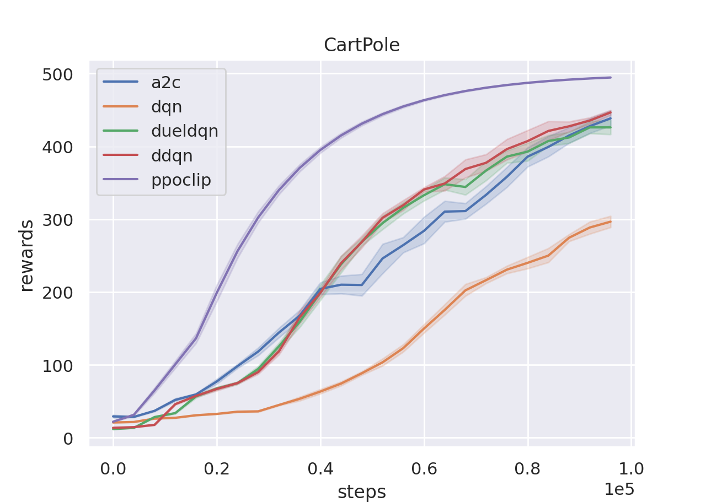
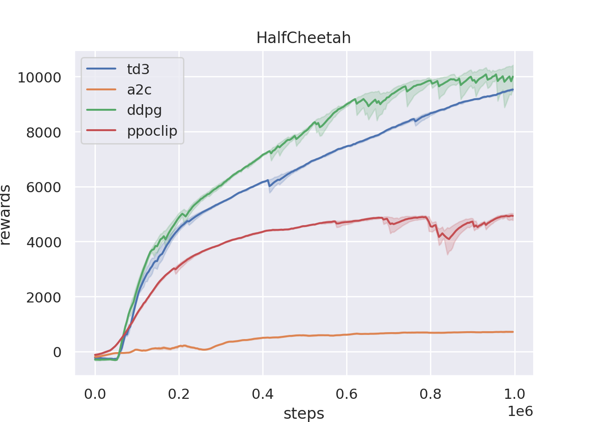

## XuanCE: A simple framework and implementations of reinforcement learning algorithm ##
This repo is a subset of the original project XuanCE with only Pytorch and single-agent RL algorithm implementations. 
We pruned the architecture and remains an easy-to-use and compatiable codebase.
Currently, this repo support the following RL algorithms which are:
- Deep-Q Network(DQN)
- Dueling-Q Network(Duel-DQN)
- Double-Q Network(DDQN)
- Advantage Actor-Critic(A2C)
- Proximal Policy Optimization(PPO-CLIP)
- Deep Deterministic Policy Gradient(DDPG)
- Twin Delayed DDPG(TD3)

We briefly introduce several scenarios to use our RL codebase for beginners.
- If you want to test whether RL can be equipped for your own problem, 
the only thing you need is define a environment class similar to gym.Env and drop it into the environment/custom_envs. 
- If you want to propose a more complex encoder, just add your module into representation/network.py file and replace the representation module with yours in the training demos in examples/.
- If you figure out a better ways for RL optimization, just add a learner and re-write the loss function.
- ...

More algorithms and documentations in detail are on the way.
More performance evaluations are on the way.
Some experiment results are shown below:

<!--  -->

